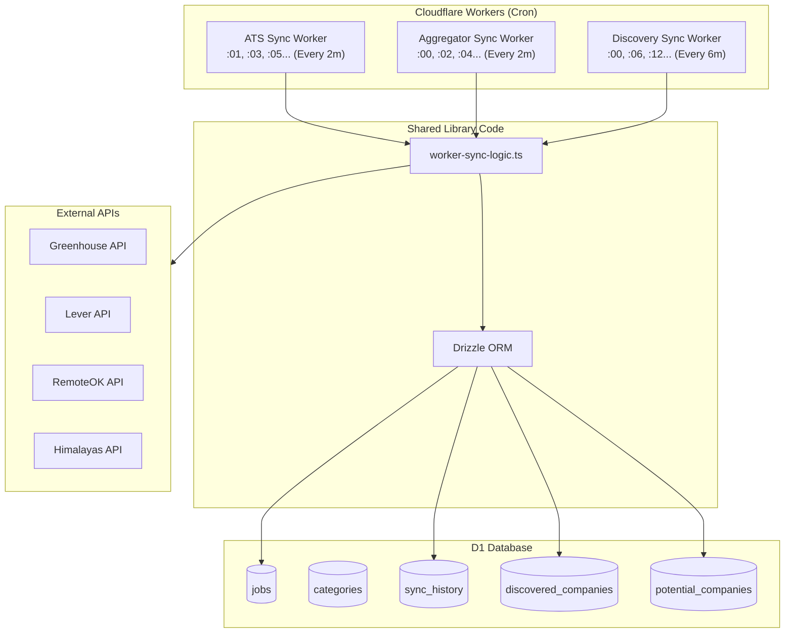
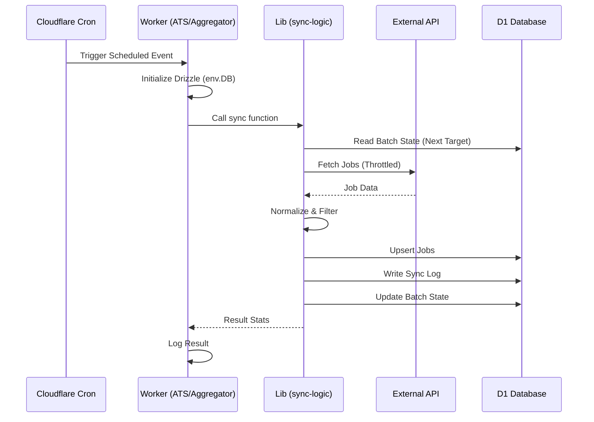

# Spearyx Jobs V3 Sync Architecture

> Comprehensive documentation for the V3 jobs discovery and synchronization system.

## Table of Contents

1. [Overview](#overview)
2. [Architecture](#architecture)
3. [Tech Stack](#tech-stack)
4. [Workers](#workers)
5. [API Endpoints](#api-endpoints)
6. [Database Schema](#database-schema)
7. [Data Flow](#data-flow)
8. [Rate Limiting & Throttling](#rate-limiting--throttling)
9. [Error Handling](#error-handling)
10. [Deployment](#deployment)

---

## Overview

The V3 Jobs Sync system is a distributed job aggregation platform that collects remote job listings from multiple sources and presents them through a unified interface. It runs on Cloudflare Workers with D1 (SQLite) as the database.

### Key Features

- **Multi-source aggregation**: Greenhouse, Lever, RemoteOK, Himalayas
- **Direct D1 Access**: Workers write directly to the database for performance and reliability
- **Company discovery**: Automatically discovers new companies with remote jobs
- **Lazy cleansing**: Raw job descriptions are sanitized on-demand
- **Tag-based cycling**: RemoteOK queries cycle through 13 different tags for variety
- **Staggered scheduling**: Workers run at offset intervals to prevent collisions

### Sources

| Source | Type | API | Rate Limit |
|--------|------|-----|------------|
| Greenhouse | ATS | `boards-api.greenhouse.io/v1/boards/{company}/jobs` | 1 req/sec |
| Lever | ATS | `api.lever.co/v0/postings/{company}` | 1 req/sec |
| RemoteOK | Aggregator | `remoteok.com/api?tag={tag}` | 2 sec delay |
| Himalayas | Aggregator | `himalayas.app/jobs/api` | 2 sec delay |

---

## Architecture

The V3 system uses a **Direct D1 Access** pattern where Cloudflare Workers interact directly with the database rather than calling internal API endpoints. This reduces latency, avoids cold start timeouts on HTTP requests, and simplifies authentication.



### Component Responsibilities

| Component | Responsibility |
|-----------|---------------|
| **Workers** | Triggered by Cron, initialize DB connection, call shared sync logic |
| **Shared Logic** | `src/lib/worker-sync-logic.ts`: Handles fetching, validating, and saving data |
| **API Endpoints** | Primarily for frontend data access (Jobs, Stats, Logs) and manual debugging |
| **Database** | Persistent storage for jobs, history, and state |

---

## Tech Stack

### Core Technologies

| Technology | Purpose | Version |
|------------|---------|---------|
| **TanStack Start** | SSR React framework | ^1.132.0 |
| **TanStack Query** | Data fetching & caching state management | ^5.90.12 |
| **TanStack Pacer** | Request rate limiting & throttling | ^0.16.3 |
| **Cloudflare Workers** | Serverless compute environment | - |
| **Cloudflare D1** | Serverless SQLite database | - |
| **Drizzle ORM** | Type-safe database query builder | ^0.44.7 |
| **Vite** | Build tool and dev server | ^7.1.7 |

### Key Libraries & Usage

#### TanStack Pacer
Used to strictly enforce rate limits against external APIs, preventing 429 errors.
```typescript
import { asyncThrottle } from '@tanstack/pacer'

const fetchGreenhouse = asyncThrottle(fetch, {
  limit: 1,
  interval: 1000 // 1 request per second
});
```

#### TanStack Query
Powers the frontend data fetching for the Dashboard and Job Listings, handling caching, deduping, and background updates.

#### Drizzle ORM
Provides type-safe interaction with the D1 database.
```typescript
// Workers use D1 binding directly
const db = drizzle(env.DB, { schema });
```

---

## Workers

Workers are defined in `src/workers/*.ts` and configured via separate `wrangler.*.toml` files.

### Schedule

| Worker | Schedule | Config File | Description |
|--------|----------|-------------|-------------|
| **Aggregator** | `*/2 * * * *` (Every 2 min) | `wrangler.aggregator.toml` | Syncs RemoteOK/Himalayas |
| **ATS** | `1-59/2 * * * *` (Every 2 min) | `wrangler.ats.toml` | Syncs Greenhouse/Lever |
| **Discovery** | `*/6 * * * *` (Every 6 min) | `wrangler.discovery.toml` | Finds new companies |

### Worker Implementation

#### `src/workers/ats-sync.ts`
- **Logic**: `syncAtsCompany(db, timeStr)`
- **Function**: Reads the next company from the batch state, fetches jobs from its ATS public board, and saves them.
- **Cycle**: Alternates between Greenhouse and Lever sources.

#### `src/workers/aggregator-sync.ts`
- **Logic**: `syncAggregator(db, timeStr)`
- **Function**: Fetches a batch of jobs from an aggregator API.
- **Cycle**: Alternates between RemoteOK and Himalayas. For RemoteOK, it cycles through 13 distinct tags (dev, engineer, marketing, etc.).

#### `src/workers/discovery-sync.ts`
- **Logic**: `syncDiscovery(db, timeStr)`
- **Function**: Checks a batch of potential companies to see if they have valid public ATS boards. Valid companies are moved to `discovered_companies`.

---

## API Endpoints

While Workers handle the heavy lifting of synchronization, API endpoints (`src/routes/api/v3/`) serve the frontend and allow for manual control.

### Sync Control (Manual Triggers)
- `POST /api/v3/sync/ats`: Manually triggers an ATS sync cycle.
- `POST /api/v3/sync/aggregator`: Manually triggers an Aggregator sync.
- `POST /api/v3/sync/discovery`: Manually triggers Discovery.

### Data Access
- `GET /api/v3/jobs`: Main job listing endpoint with search, filter, and pagination.
- `GET /api/v3/stats`: Dashboard statistics (worker status, counts).
- `GET /api/v3/logs`: View recent sync logs.

---

## Database Schema

### Core Tables

#### `jobs`
| Column | Type | Description |
|--------|------|-------------|
| id | INTEGER | PK |
| title | TEXT | Job title |
| company | TEXT | Company name |
| descriptionRaw | TEXT | Original HTML/Text from source |
| fullDescription | TEXT | Sanitized/Cleaned HTML |
| sourceName | TEXT | 'greenhouse', 'lever', 'remoteok', 'himalayas' |
| externalId | TEXT | ID from the source system |

#### `sync_history`
Tracks execution of sync jobs.
- **Status**: `success`, `failed`, `running`
- **Types**: `ats`, `aggregator`, `discovery`
- **Stats**: JSON object with `jobsAdded`, `jobsUpdated`, `duration`, etc.

#### `discovered_companies`
Registry of valid companies found by the discovery worker.

---

## Data Flow

### Sync Process (Direct D1)



---

## Deployment

Deployments are managed via `wrangler`.

```bash
# Deploy all workers
npm run deploy:workers

# Individual deploys
npm run deploy:ats
npm run deploy:aggregator
npm run deploy:discovery

# Main App (Frontend + API)
npm run deploy
```
