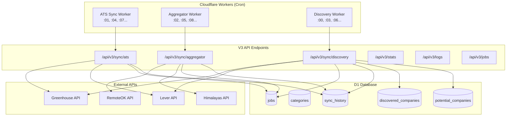
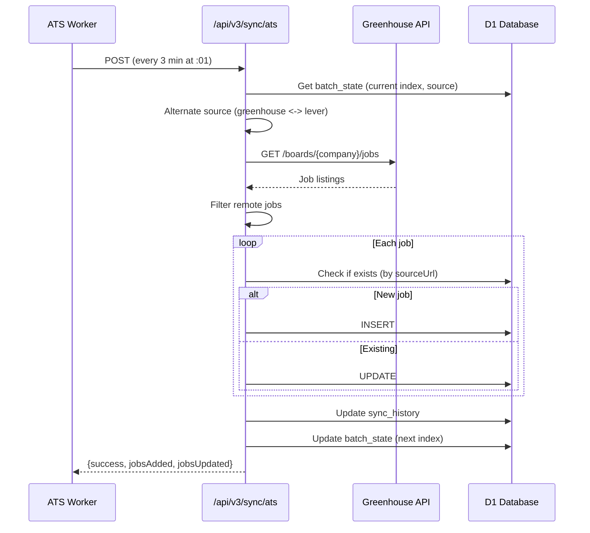
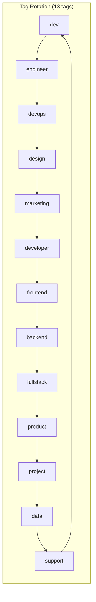

# Spearyx Jobs V3 Sync Architecture

> Comprehensive documentation for the V3 jobs discovery and synchronization system.

## Table of Contents

1. [Overview](#overview)
2. [Architecture](#architecture)
3. [Tech Stack](#tech-stack)
4. [Workers](#workers)
5. [API Endpoints](#api-endpoints)
6. [Database Schema](#database-schema)
7. [Data Flow](#data-flow)
8. [Rate Limiting & Throttling](#rate-limiting--throttling)
9. [Error Handling](#error-handling)
10. [Deployment](#deployment)

---

## Overview

The V3 Jobs Sync system is a distributed job aggregation platform that collects remote job listings from multiple sources and presents them through a unified interface. It runs on Cloudflare Workers with D1 (SQLite) as the database.

### Key Features

- **Multi-source aggregation**: Greenhouse, Lever, RemoteOK, Himalayas
- **Company discovery**: Automatically discovers new companies with remote jobs
- **Lazy cleansing**: Raw job descriptions are sanitized on-demand
- **Tag-based cycling**: RemoteOK queries cycle through 13 different tags for variety
- **Staggered scheduling**: Workers run at offset intervals to prevent collisions

### Sources

| Source | Type | API | Rate Limit |
|--------|------|-----|------------|
| Greenhouse | ATS | `boards-api.greenhouse.io/v1/boards/{company}/jobs` | 1 req/sec |
| Lever | ATS | `api.lever.co/v0/postings/{company}` | 1 req/sec |
| RemoteOK | Aggregator | `remoteok.com/api?tag={tag}` | 2 sec delay |
| Himalayas | Aggregator | `himalayas.app/jobs/api` | 2 sec delay |

---

## Architecture



### Component Responsibilities

| Component | Responsibility |
|-----------|---------------|
| **Workers** | Trigger syncs on cron schedule, call V3 API endpoints |
| **API Endpoints** | Execute sync logic, interact with external APIs and database |
| **sync-queue.ts** | Throttled fetchers, retry logic, logging |
| **Database** | Persistent storage for jobs, history, and state |

---

## Tech Stack

### Core Technologies

| Technology | Purpose | Version |
|------------|---------|---------|
| **TanStack Start** | SSR React framework | Latest |
| **TanStack Query** | Data fetching & caching (dashboard) | v5 |
| **TanStack Pacer** | Rate limiting & throttling | v0.x |
| **Cloudflare Workers** | Serverless compute | - |
| **Cloudflare D1** | SQLite database | - |
| **Drizzle ORM** | Type-safe database queries | Latest |

### Frontend Stack

| Technology | Purpose |
|------------|---------|
| React 19 | UI framework |
| TanStack Router | File-based routing |
| Lucide Icons | Icon library |
| @spearyx/ui-kit | Internal component library |

### Key Libraries

```typescript
// Rate limiting with TanStack Pacer
import { asyncThrottle } from '@tanstack/pacer'

// Database with Drizzle
import { drizzle } from 'drizzle-orm/d1'

// React data fetching
import { useQuery } from '@tanstack/react-query'
```

---

## Workers

Three independent Cloudflare Workers handle sync operations on staggered cron schedules.

### Schedule (All times in minutes past the hour)

| Worker | Schedule | Interval | Offset |
|--------|----------|----------|--------|
| Discovery | `:00, :03, :06, :09...` | 3 min | 0 |
| ATS | `:01, :04, :07, :10...` | 3 min | +1 |
| Aggregator | `:02, :05, :08, :11...` | 3 min | +2 |

### Worker Files

#### `src/workers/ats-sync.ts`
- Calls `/api/v3/sync/ats`
- Cycles through Greenhouse/Lever companies
- One company per execution

#### `src/workers/aggregator-sync.ts`
- Calls `/api/v3/sync/aggregator`
- Alternates between RemoteOK and Himalayas
- RemoteOK uses tag-based cycling for variety

#### `src/workers/discovery-sync.ts`
- Calls `/api/v3/sync/discovery`
- Checks potential companies for valid job boards
- Adds discovered companies to the sync rotation

---

## API Endpoints

All V3 endpoints are under `/api/v3/`.

### Sync Endpoints

#### `POST /api/v3/sync/ats`
Syncs jobs from one ATS company (Greenhouse or Lever).

**Behavior:**
- Reads batch state to get current company index and source
- Alternates between Greenhouse and Lever lists
- Filters for remote jobs only
- Updates batch state to advance to next company

**Response:**
```json
{
  "success": true,
  "source": "greenhouse",
  "company": "stripe",
  "jobsAdded": 5,
  "jobsUpdated": 12,
  "jobsDeleted": 0,
  "duration": 1234
}
```

#### `POST /api/v3/sync/aggregator`
Syncs jobs from RemoteOK or Himalayas.

**RemoteOK Tag Cycling:**
```typescript
const REMOTEOK_TAGS = [
  'dev', 'engineer', 'devops', 'design', 'marketing',
  'developer', 'frontend', 'backend', 'fullstack',
  'product', 'project', 'data', 'support'
]
```

#### `POST /api/v3/sync/discovery`
Discovers new companies with remote job boards.

**Process:**
1. Get pending companies from `potential_companies`
2. Check for Greenhouse/Lever API availability
3. Filter for remote jobs
4. Add to `discovered_companies` if valid

### Data Endpoints

#### `GET /api/v3/jobs`
Returns job listings with filtering and pagination.

**Query Parameters:**
- `search` - Full-text search
- `category` - Category ID filter
- `source` - Source filter (Greenhouse, Lever, etc.)
- `salaryRange` - Salary range filter
- `sortBy` - newest, oldest, title-asc, title-desc
- `limit`, `page` - Pagination

#### `GET /api/v3/categories`
Returns categories with job counts.

#### `GET /api/v3/job-content?url={url}&company={company}`
Fetches full job description with lazy cleansing.

**Lazy Cleansing Flow:**
1. Check if `descriptionRaw` exists and `isCleansed = 0`
2. Sanitize HTML using `html-utils.ts`
3. Update job with cleansed version
4. Return clean content

#### `GET /api/v3/stats`
Returns dashboard statistics including worker status.

#### `GET /api/v3/logs?limit={n}`
Returns recent sync logs with error details.

---

## Database Schema

### Tables

#### `jobs`
Primary job listings table.

| Column | Type | Description |
|--------|------|-------------|
| id | INTEGER | Primary key |
| title | TEXT | Job title |
| company | TEXT | Company name |
| description | TEXT | Clean summary (200 words) |
| descriptionRaw | TEXT | Raw source data (lazy cleansing) |
| fullDescription | TEXT | Full sanitized HTML |
| isCleansed | INTEGER | 0 = needs cleansing, 1 = done |
| payRange | TEXT | Salary info |
| sourceUrl | TEXT | Original job URL |
| sourceName | TEXT | Greenhouse, Lever, etc. |
| categoryId | INTEGER | FK to categories |
| remoteType | TEXT | fully_remote, hybrid, etc. |

#### `categories`
Job categories for filtering.

| Column | Type | Description |
|--------|------|-------------|
| id | INTEGER | Primary key |
| name | TEXT | Display name |
| slug | TEXT | URL-safe identifier |

**Predefined Categories:**
1. Programming & Development
2. Project Management
3. Design
4. Marketing
5. Data Science & Analytics
6. DevOps & Infrastructure
7. Customer Support
8. Sales
9. Product Management

#### `sync_history`
Tracks all sync operations and batch state.

| Column | Type | Description |
|--------|------|-------------|
| id | TEXT | UUID primary key |
| syncType | TEXT | job_sync, discovery, ats, aggregator |
| source | TEXT | greenhouse, lever, remoteok, himalayas |
| status | TEXT | running, completed, failed, batch_state |
| stats | JSON | {jobsAdded, jobsUpdated, ...} |
| logs | JSON | Array of log entries |

**Batch State Records:**
- `status = 'batch_state'` records store rotation state
- `syncType = 'ats'`: tracks company index and last source
- `syncType = 'aggregator'`: tracks last source and tag index

#### `discovered_companies`
Companies that have been verified to have job boards.

#### `potential_companies`
Companies queued for discovery checking.

---

## Data Flow

### ATS Sync Flow



### RemoteOK Tag Cycling



Each aggregator sync advances to the next tag, ensuring coverage across all categories.

---

## Rate Limiting & Throttling

### TanStack Pacer Integration

```typescript
// src/lib/sync-queue.ts
export const sourceFetchers = {
  greenhouse: createSourceFetcher('greenhouse', 1000),  // 1 req/sec
  lever: createSourceFetcher('lever', 1000),
  remoteok: createSourceFetcher('remoteok', 2000),      // Slower
  himalayas: createSourceFetcher('himalayas', 2000)
}
```

### Retry Logic

```typescript
export async function withRetry<T>(
  fn: () => Promise<T>,
  options: {
    maxRetries?: number      // Default: 3
    baseDelayMs?: number     // Default: 1000
    maxDelayMs?: number      // Default: 10000
  }
): Promise<T>
```

Uses exponential backoff: delay = min(baseDelay * 2^attempt, maxDelay)

---

## Error Handling

### Content-Type Validation
APIs check `Content-Type: application/json` before parsing to avoid HTML error pages.

### Graceful Skip
Companies without valid job boards are logged and skipped:
```
[greenhouse] ℹ️ pinterest: Not a valid API (returned HTML)
```

### Batch State Always Advances
Even on errors, the batch state index increments to prevent getting stuck.

### Log Isolation
Each sync clears logs at start to prevent cross-sync contamination:
```typescript
syncQueue.clearLogs()
```

---

## Deployment

### Wrangler Configurations

| Config | Worker | Entrypoint |
|--------|--------|------------|
| `wrangler.ats.toml` | spearyx-sync-ats | `src/workers/ats-sync.ts` |
| `wrangler.aggregator.toml` | spearyx-sync-aggregator | `src/workers/aggregator-sync.ts` |
| `wrangler.discovery.toml` | spearyx-sync-discovery | `src/workers/discovery-sync.ts` |
| `wrangler.toml` | spearyx-jobs (main app) | Standard TanStack Start |

### Deploy Commands

```bash
# Deploy main app
npm run build && npx wrangler deploy

# Deploy workers
npx wrangler deploy --config wrangler.ats.toml
npx wrangler deploy --config wrangler.aggregator.toml
npx wrangler deploy --config wrangler.discovery.toml

# Deploy all workers
npm run deploy:workers
```

### D1 Database

- **Name**: spearyx-jobs
- **ID**: `991bbe3f-8b3a-4ce4-9de8-c2110052662f`
- **Binding**: `env.DB`

### Migrations

```bash
# Apply migrations
npx wrangler d1 migrations apply spearyx-jobs --remote
```

---

## Monitoring

### Dashboard

Access at: `https://jobs.spearyx.com/sync`

**Features:**
- Worker status cards with last sync time
- Recent sync logs with expandable details
- Manual "Trigger Now" buttons
- Auto-refresh every 30 seconds
- Job and company statistics

### Cloudflare Dashboard

Workers observability is enabled:
```toml
[observability]
enabled = true
```

View logs at: Cloudflare Dashboard → Workers → Logs

---

## File Structure

```
apps/jobs/
├── src/
│   ├── routes/
│   │   ├── api/v3/
│   │   │   ├── sync/
│   │   │   │   ├── ats.ts
│   │   │   │   ├── aggregator.ts
│   │   │   │   └── discovery.ts
│   │   │   ├── jobs.ts
│   │   │   ├── categories.ts
│   │   │   ├── job-content.ts
│   │   │   ├── stats.ts
│   │   │   └── logs.ts
│   │   ├── index.tsx (home page)
│   │   └── sync.tsx (dashboard)
│   ├── workers/
│   │   ├── ats-sync.ts
│   │   ├── aggregator-sync.ts
│   │   └── discovery-sync.ts
│   ├── lib/
│   │   ├── sync-queue.ts
│   │   ├── html-utils.ts
│   │   ├── pacer-utils.ts
│   │   └── job-sources/
│   │       ├── greenhouse.ts
│   │       ├── lever.ts
│   │       └── ...
│   └── db/
│       ├── schema.ts
│       └── db.ts
├── wrangler.toml
├── wrangler.ats.toml
├── wrangler.aggregator.toml
└── wrangler.discovery.toml
```
